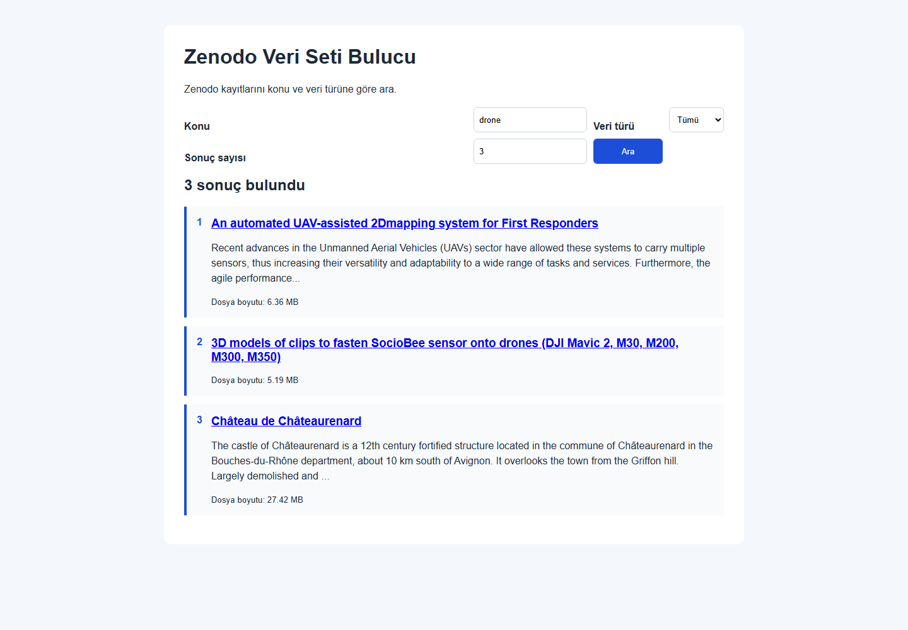

# Zenodo Veri Seti Bulucu

Bitirme projem için veri seti ararken Zenodo, Kaggle ve Google Dataset Search sonuçlarını tek tek inceliyordum. Veri setinin türünü, konusunu ve dosya boyutunu anlamak için kayıt açıklamalarını ve dosyalarını ayrıca kontrol ediyordum. Son yedi günde tuttuğum 16 arama kaydında toplam tahmini 894 dakika harcadım ve üç veri setini uygun buldum.

Bu Sinatra web uygulaması Zenodo'da konu ve veri türüne göre arama yapar. Sonuçlarda başlık, açıklama, toplam dosya boyutu ve Zenodo bağlantısı gösterilir.



## Kurulum

1. Ruby'nin kurulu olduğunu doğrula:

   ```bash
   ruby -v
   ```

2. Proje klasöründe bağımlılıkları yükle:

   ```bash
   bundle install
   ```

## Çalıştırma

```bash
bundle exec ruby app.rb
```

Tarayıcıda `http://localhost:4567` adresini aç. Konu, veri türü ve sonuç sayısını girip **Ara** butonuna bas.

## Test

```bash
bundle exec ruby test/zenodo_client_test.rb
```

Son doğrulama sonucu:

```text
1 runs, 2 assertions, 0 failures, 0 errors, 0 skips
```

## Log

Her arama `zenodo_search.log` dosyasına aşağıdaki bilgilerle kaydedilir:

```text
tarih | arama konusu | veri türü | bulunan sonuç sayısı
```

## Kullanıcı kontrolü

Uygulama Zenodo API'den sonuçları otomatik getirir ve seçilen veri türüne göre başlık, açıklama ve anahtar kelimelerde eşleşme arar. Veri setinin bitirme projesine gerçekten uygun olduğuna kullanıcı, sonuç bağlantısını açıp veri setini inceleyerek karar verir. Bu karar veri setinin içerik kalitesi ve proje ihtiyacına bağlı olduğu için kullanıcıya bırakılmıştır.

## Dosyalar

- `app.rb`: Web uygulaması
- `zenodo_search.rb`: Komut satırı sürümü
- `test/zenodo_client_test.rb`: Minitest testi
- `veri_seti_agri_gunlugu.csv`: Önceki arama kayıtları
- `sonrasi_kullanim_gunlugu.csv`: Beş günlük gerçek kullanım kaydı için şablon
- `zenodo_search.log`: Uygulama çalışma logu

## Sonrasi kullanim kaniti

22-27 Eylul 2026 arasinda logda 6 farkli gun ve toplam 16 arama kaydi vardir. Bu kayitlar `sonrasi_kullanim_gunlugu.csv` dosyasina aktarildi. Log aramanin yapildigini ve sonuc sayisini kanitlar; dakika kazanimi logdan hesaplanamaz. Sunumdan once aracsiz ve aracli sureleri kronometre ile olcerek CSV'deki dakika alanlarini doldur.

## Acinin tek paragraf aciklamasi

Bitirme projem icin veri seti arayan kisi benim. 21-26 Eylul arasinda Zenodo ve Kaggle'da arama yaparken her kaydin aciklamasini, veri turunu ve dosyalarini tek tek kontrol ettim; 16 aramada toplam 894 dakika harcadim ve uygun olmayan kayitlari eledim. Mevcut cozumum arama sitelerini ayri ayri acip sonuclari elle karsilastirmakti; takildigim nokta ayni konu icin farkli sitelerde ve farkli veri turlerinde tekrar tekrar arama yapmamdi.
